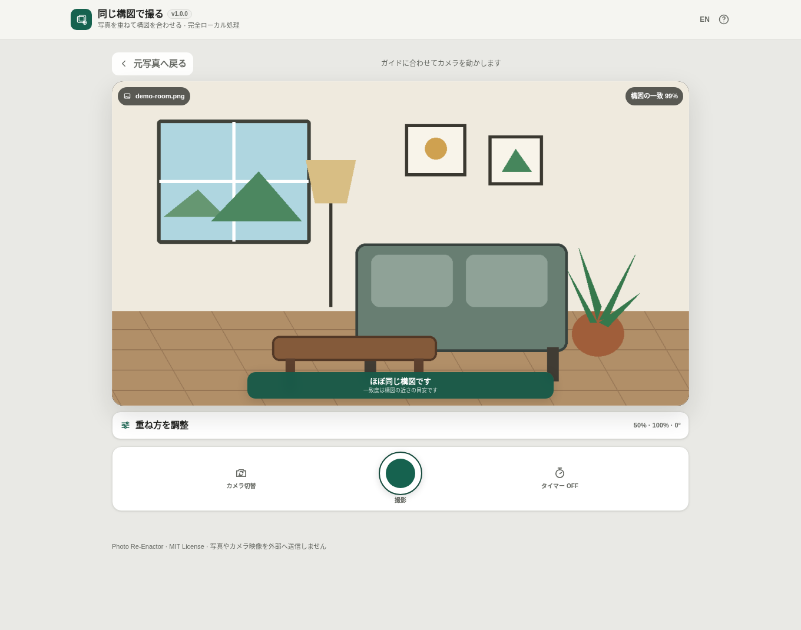

# Photo Re-Enactor — 同じ構図で撮る

[](https://github.com/ttomohisa/htmlapps-photo-re-enactor/actions/workflows/deploy-pages.yml)
[](LICENSE)
[](https://ttomohisa.github.io/htmlapps-photo-re-enactor/)

[English README](README.md)

昔の写真や Before 写真をカメラ映像へ重ね、できるだけ同じ構図で撮り直すための Browser Kitty アプリです。元写真とカメラ映像は端末内だけで処理し、アプリから外部へ送信しません。

## 🚀 デモ

### [GitHub PagesでPhoto Re-Enactorを開く](https://ttomohisa.github.io/htmlapps-photo-re-enactor/)

GitHub Pagesから最初のHTMLを読み込んだ後、元写真の読み込み、カメラ映像、構図ガイド、撮影、比較、保存はブラウザ内で処理されます。選んだ写真やカメラ映像をアプリがサーバーへ送信することはありません。

[](https://ttomohisa.github.io/htmlapps-photo-re-enactor/)

## 主な機能

- **元写真を見ながら同じ構図へ近づける** — JPEG / PNG / WebP を読み込み、ライブカメラへ重ねて撮影できます。
- **4種類の重ね表示** — Ghost / Outline / Blink / Split を場面に応じて切り替えられます。
- **次の動きを1つずつ案内** — 左右・上下・距離・傾きのうち大きなずれを端末内で推定し、平易な文言で表示します。
- **手動でも最後まで使える** — 自動ガイドが使いにくい場面では「元写真を手動調整」をONにして、移動・拡大縮小・回転を調整できます。
- **撮影タイマー** — OFF / 3 / 5 / 10秒。カウント中のキャンセルにも対応します。
- **その場でBefore / After比較** — Split / Ghost / Blink を切り替えられ、Splitでは画像上の境界ハンドルを直接左右へ動かせます。
- **3種類の保存** — 撮影したJPEG、左右または上下比較JPEG、写真を内包した比較用単一HTMLを書き出せます。比較HTMLでも Split / Ghost / Blink を切り替え、Before / After の写真を個別保存できます。
- **QRコードリーダーと揃えたカメラUI** — スマートフォンではカメラを全画面表示し、縦画面・横画面とも半透明の操作UIを映像上へ重ねます。
- **完全ローカル処理** — ランタイム外部通信、analytics、telemetry、アカウント登録はありません。

## すぐに使う

### Webで使う

[デモを開く](https://ttomohisa.github.io/htmlapps-photo-re-enactor/)だけで利用できます。インストールやアカウント登録は不要です。

カメラAPIのセキュリティ制約があるため、撮影用途では **HTTPS のGitHub Pages版を推奨**します。

### 単一HTMLを使う

リリース成果物は `dist/index.html` と `dist/index.self-extract.html` です。どちらも必要なアプリコードを単体にまとめています。

ただしブラウザによっては `file://` から開いたHTMLへカメラ利用を許可しません。カメラ撮影を確認するときは HTTPS または localhost で開いてください。

## 使い方

1. 「元写真を選ぶ」で、撮り直したい JPEG / PNG / WebP を選びます。この時点ではカメラ権限を要求しません。
2. 元写真を確認して「撮影を開始」を押します。
3. Ghost / Outline / Blink / Split から見やすい表示を選び、構図ガイドが利用できる場合は案内に合わせてカメラを動かします。
4. 元写真自体を調整したい場合だけ「元写真を手動調整」をONにし、ドラッグ・ピンチ・回転操作を行います。OFFに戻すと構図ガイドが再開します。
5. 必要なら 3 / 5 / 10秒タイマーを選び、撮影ボタンを押します。一致度が低くても撮影できます。
6. 撮影後は Split / Ghost / Blink を切り替えて Before / After を確認します。Splitでは画像上の境界を直接動かせます。
7. 「比較JPEGの配置」で「左右」（初期値）または「上下（上がBefore、下がAfter）」を選び、撮影した写真、比較画像、比較HTMLから必要な形式だけ保存します。比較HTML内でも表示方式を切り替え、Before / After を個別に保存できます。「撮り直す」は確認後に撮影画面へ戻ります。

比較保存には保存開始時の写真・ファイル名・配置・HTMLの情報を使います。保存中の入力変更は次の保存に反映されます。別の元写真や新しい撮影結果へ変わった場合は、未完了の保存を中止します。上下比較のファイル名は `-compare-stacked.jpg`、左右比較は従来の `-compare.jpg` です。配置はページを再読み込みすると初期値へ戻り、写真の縦横比や画面上の比較表示は変えません。

## 構図ガイドについて

構図ガイドは元写真と縮小したカメラフレームを端末内で比較し、左右・上下・拡大率・回転のずれを推定します。

- 一致度は**写真品質ではなく構図の近さの目安**です。
- 一致度を撮影条件にはせず、ユーザーはいつでも撮影できます。
- 特徴が少ない場面、暗所、ぼけ、大きく変化した風景などでは自動ガイドを利用できない場合があります。
- 解析できない場合も、重ね表示と手動調整で撮影を続けられます。
- 解析は間欠的にWorkerで行い、ライブ映像や撮影操作をブロックしません。

## GitHub Pagesで公開する

このリポジトリには、Windows runner でテンプレート標準の Repository Check と単一HTMLビルドを実行し、GitHub Pagesへ公開するワークフローが含まれています。

1. `ttomohisa/htmlapps-photo-re-enactor` としてGitHubへプッシュします。
2. **Settings → Pages → Build and deployment → Source** で **GitHub Actions** を選択します。
3. `main` へプッシュするか、Actionsから **Deploy standalone app to GitHub Pages** を手動実行します。
4. 成功後、`https://ttomohisa.github.io/htmlapps-photo-re-enactor/` で公開されます。

`main` へのプッシュ時には `scripts/check-repository.ps1` が Windows 上で実行され、単一HTMLと自己展開HTMLを再生成・検証してから公開します。

## 開発とビルド

全体検証に含まれるオフラインの比較保存テストには Node.js 20 以降が必要です。npm依存パッケージは不要です。

Windowsではテンプレート標準のビルドを使用します。

```powershell
.\build-standalone.bat
```

リポジトリ全体の検査を含めて実行する場合:

```powershell
.\scripts\check-repository.ps1
```

カメラ確認時は `file://` ではなく HTTPS または localhost で開いてください。

## プライバシーと外部通信

- 元写真、カメラ映像、撮影画像はブラウザ内だけで処理します。
- 写真を LocalStorage / IndexedDB へ自動保存しません。
- ユーザーが明示的に保存したときだけファイルを出力します。
- 比較HTMLには元写真と撮影した写真が埋め込まれます。共有すると写真も相手へ渡ることを保存前に案内します。
- ランタイムCSPは `connect-src 'none'` です。
- CDN、外部API、analytics、telemetryは使用しません。

GitHub Pages版ではページを開くためのHTML配信自体は発生しますが、ユーザーが選んだ写真やカメラ映像をアプリから外部へ送信する処理はありません。

## 制限事項

- 自動構図ガイドは補助機能であり、大きな視点差や特徴の少ない場面では利用できないことがあります。
- 人物ポーズの自動一致、人物識別、構図一致を条件にした自動撮影は現在のリリースには含みません。
- 利用できるカメラ、解像度、Wake Lock、振動フィードバックはブラウザや端末によって異なります。
- `file://` で開いた単一HTMLからのカメラ利用はブラウザのセキュリティ制約を受けます。

## コントリビューション

バグ報告や機能提案はIssueからお願いします。開発への参加方法は [CONTRIBUTING.md](CONTRIBUTING.md) を確認してください。

## ライセンス

Copyright © 2026 ttomohisa

このプロジェクトは [MIT License](LICENSE) で公開されています。

## レイアウト点検

v1.1.4では狭いヘッダーでもアプリ名とバージョンを表示し、使い方を開いている間は背景のスクロールを止めます。既存の使い方のスクロール領域は維持します。元写真の読み込み、カメラ、撮影、保存の一連の操作は別途検証が必要です。
