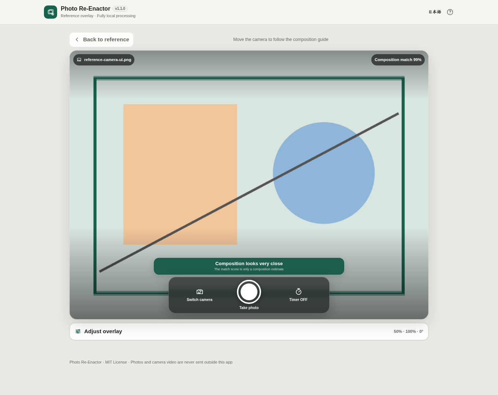

# Photo Re-Enactor

[](https://github.com/ttomohisa/htmlapps-photo-re-enactor/actions/workflows/deploy-pages.yml)
[](LICENSE)
[](https://ttomohisa.github.io/htmlapps-photo-re-enactor/)

[日本語版 README](README.ja.md)

Photo Re-Enactor is a Browser Kitty app for retaking a scene from nearly the same composition by placing a previous or Before photo over the live camera. Reference photos and camera frames are processed locally and are not uploaded by the app.

## 🚀 Live demo

### [Open Photo Re-Enactor on GitHub Pages](https://ttomohisa.github.io/htmlapps-photo-re-enactor/)

GitHub Pages delivers the initial HTML. After it loads, reference-photo decoding, camera frames, composition guidance, capture, comparison, and export are processed inside the browser. The app does not upload the selected photo or camera feed.

[](https://ttomohisa.github.io/htmlapps-photo-re-enactor/)

## Features

- **Recreate a previous composition** — Load a JPEG / PNG / WebP reference and place it over the live camera while shooting.
- **Four overlay views** — Switch among Ghost, Outline, Blink, and Split depending on the scene.
- **One plain-language instruction at a time** — Local analysis estimates the largest horizontal, vertical, distance, or tilt offset and tells you what to adjust next.
- **A complete manual fallback** — If automatic guidance is unsuitable, explicitly enable **Adjust reference manually** and move, zoom, or rotate the reference yourself.
- **Shooting timer** — OFF / 3 / 5 / 10 seconds with cancellation.
- **Flexible Before / After comparison** — Switch among Split, Ghost, and Blink; in Split mode, drag the divider directly on the result image.
- **Three export options** — Save the captured JPEG, a side-by-side or stacked comparison JPEG, or a standalone comparison HTML with both photos embedded. The comparison HTML also supports Split / Ghost / Blink and individual Before / After downloads.
- **QR Reader-style camera UI** — On smartphones, the live view fills the screen and translucent camera controls stay over the image in both portrait and landscape.
- **Fully local processing** — No runtime external connections, analytics, telemetry, login, or automatic upload.

## Quick start

### Use the web demo

Just [open the demo](https://ttomohisa.github.io/htmlapps-photo-re-enactor/). No installation or account is required.

Because camera APIs require a secure context in current browsers, the **HTTPS GitHub Pages version is recommended for shooting**.

### Use the single HTML

Release artifacts are `dist/index.html` and `dist/index.self-extract.html`. Both package the application into a single file.

Some browsers do not allow camera access from an HTML file opened through `file://`. Use HTTPS or localhost when testing or using the camera.

## Usage

1. Choose the JPEG / PNG / WebP photo whose composition you want to recreate. Camera permission is not requested yet.
2. Review the reference and press **Start shooting**.
3. Choose Ghost / Outline / Blink / Split as needed, then move the camera according to the composition guide when it is available.
4. If the reference itself needs adjustment, enable **Adjust reference manually**, then drag, pinch/zoom, or rotate it. Turning the mode off resumes composition guidance.
5. Optionally choose a 3 / 5 / 10 second timer and press the shutter. A low match score never blocks capture.
6. After capture, switch among Split, Ghost, and Blink to compare Before and After. In Split mode, drag the divider directly on the image.
7. Choose **Side by side** (default) or **Stacked (Before above After)** in **Comparison JPEG layout**, then save the captured photo, comparison image, and/or standalone comparison HTML. The HTML can also download Before and After individually. **Retake** asks for confirmation before returning to the camera while keeping the same reference and alignment.

Comparison exports use the photos, filename, layout, and HTML details from when saving starts. Changes to these fields apply to the next export. Replacing the reference or completing another capture cancels an unfinished export. Stacked JPEGs use `-compare-stacked.jpg`; horizontal JPEGs keep `-compare.jpg`. The layout is session-only and resets on reload; it does not change the photos’ aspect ratio or the interactive comparison viewer.

## Composition guide

The guide compares the reference with downscaled camera frames locally and estimates horizontal offset, vertical offset, scale, and rotation.

- The match score estimates **composition similarity, not photo quality**.
- Guidance never becomes a capture requirement.
- Low-detail scenes, darkness, blur, or scenes that changed substantially can make automatic guidance unavailable.
- Manual overlay shooting remains available when automatic comparison is unreliable.
- Analysis runs intermittently in a Worker so camera display and capture remain responsive.

## Publish with GitHub Pages

The repository includes a workflow that runs the template's standard Repository Check and single-HTML build on a Windows runner, then deploys the result to GitHub Pages.

1. Push the repository as `ttomohisa/htmlapps-photo-re-enactor`.
2. Open **Settings → Pages → Build and deployment → Source** and select **GitHub Actions**.
3. Push to `main`, or manually run **Deploy standalone app to GitHub Pages** from Actions.
4. After a successful deployment, the app is available at `https://ttomohisa.github.io/htmlapps-photo-re-enactor/`.

Every push to `main` runs `scripts/check-repository.ps1` on Windows, rebuilds and verifies the readable and self-extracting single HTML files, and then publishes `dist`.

## Development and build

Node.js 20 or newer is required for the offline export regression tests in the full repository check. No npm dependencies are needed.

Use the template-standard Windows build:

```powershell
.\build-standalone.bat
```

To run the full repository validation and build:

```powershell
.\scripts\check-repository.ps1
```

Use HTTPS or localhost when testing the camera.

## Privacy and runtime network protection

- Reference photos, camera frames, and captured images stay inside the browser.
- Photos are not automatically persisted to LocalStorage / IndexedDB.
- Output is produced only after an explicit save action.
- The comparison HTML embeds both photos. Sharing that file also shares the embedded photos; the app explains this before export.
- Runtime CSP keeps `connect-src 'none'`.
- There are no runtime CDN dependencies, external APIs, analytics, or telemetry.

The GitHub Pages version still requires the initial HTML request, but the app does not transmit the selected photo or camera feed afterward.

## Limitations

- Automatic composition guidance is an aid and can become unavailable with large viewpoint changes or low-detail scenes.
- Person-pose matching, person identification, and match-triggered automatic capture are not included in the current release.
- Camera availability, resolution, Wake Lock, and vibration feedback vary by browser and device.
- Camera access from a single HTML opened through `file://` is subject to browser security restrictions.

## Contributing

Bug reports and feature proposals are welcome through GitHub Issues. See [CONTRIBUTING.md](CONTRIBUTING.md) for development guidance.

## License

Copyright © 2026 ttomohisa

Licensed under the [MIT License](LICENSE).

## Responsive layout audit

The v1.1.4 patch keeps the app name/version visible in narrow headers and pauses background scrolling while Help is open. The existing Help scroll area is preserved. Loaded reference, camera, capture and export workflows remain separate verification gates.
